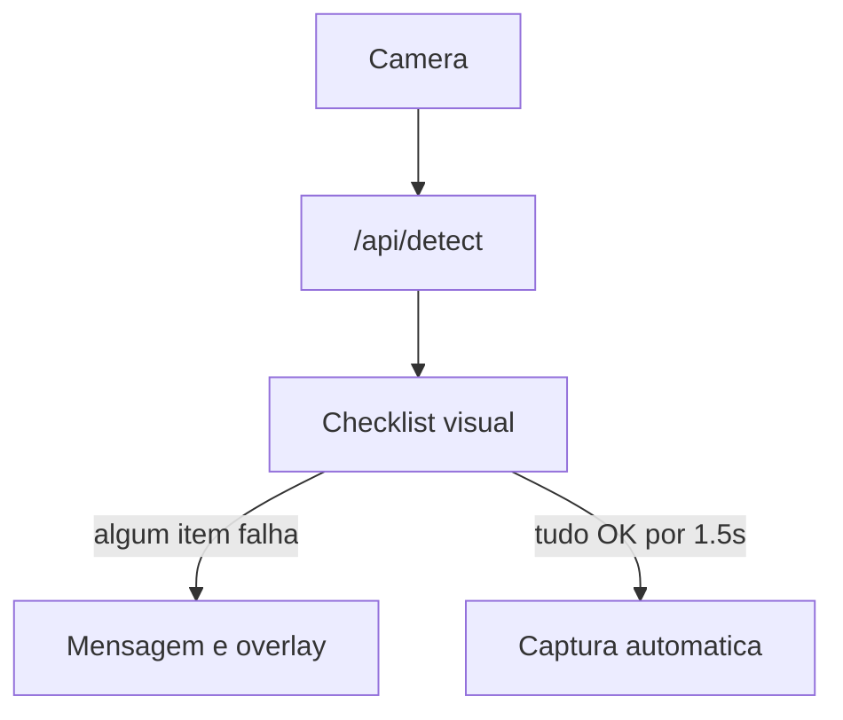

# Escaneamento facial no cadastro

## Situação atual

O cadastro em [`templates/register.html`](templates/register.html) já chama `/api/detect` e bloqueia óculos escuros/boné/olhos fechados, mas a UX é só chips + texto. Falta a sensação de **scan** e um checklist explícito antes da captura automática.

A lógica de análise já existe em [`facial_analysis.py`](facial_analysis.py) (`analyze_full_face`) e landmarks YuNet já voltam em [`app.py`](app.py) `/api/detect`.

## Abordagem

### 1. Backend: checklist estruturado

Em [`facial_analysis.py`](facial_analysis.py), enriquecer `analyze_full_face` para retornar:

- `checks`: lista ordenada de itens `{ id, label, ok, detail }`
  - `face` — rosto detectado
  - `position` — centralizado e tamanho adequado (também calculável no front; no backend via bbox relativo se possível, ou só front)
  - `lighting` — brilho adequado
  - `sharpness` — nitidez
  - `eyes` — ambos abertos (landmarks)
  - `sunglasses` — sem óculos escuros
  - `hat` — sem chapéu/boné
  - `pose` — frontal (olhos alinhados / nariz central, reutilizar lógica de pose do recognizer)
- `scan_progress`: % de checks OK
- `capture_ready`: true só se **todos** os checks críticos estiverem OK

Expor `checks`, `scan_progress`, `landmarks` e `brightness`/`sharpness` em `/api/detect` ([`app.py`](app.py)).

### 2. Frontend cadastro: UI de scan

Em [`templates/register.html`](templates/register.html) (e espelhar em [`templates/admin_edit.html`](templates/admin_edit.html)):

- Substituir chips soltos por **painel de checklist** (`#scanChecklist`) com ícones ok/pendente.
- Overlay:
  - bbox do rosto
  - pontos dos olhos/nariz/boca (landmarks) com leve animação de “scan”
  - cor verde só quando 100% pronto
- Texto guia = primeiro item pendente do checklist.
- Captura automática só se:
  - `capture_ready`
  - posição/tamanho OK no frame
  - `readyStreak` ~ **3 frames** (~1.5s) estáveis
- Barra de progresso do scan (`scan_progress`).
- Manual “Capturar” continua exigindo o mesmo checklist completo.

### 3. Estilos

Em [`static/style.css`](static/style.css):

- `.scan-checklist`, `.scan-item`, `.scan-item.ok`, `.scan-progress`
- Landmark dots no overlay (via canvas; CSS só para checklist)
- Mobile: checklist compacta abaixo da câmera

### 4. Fora de escopo

- Não muda o fluxo da simulação
- Não troca o modelo (continua YuNet + heurísticas atuais)
- Óculos transparentes seguem só como aviso, sem bloquear

## Arquivos

- [`facial_analysis.py`](facial_analysis.py) — checks + pose
- [`app.py`](app.py) — serializar checks/progress no `/api/detect`
- [`templates/register.html`](templates/register.html) — UI scan + landmarks + streak
- [`templates/admin_edit.html`](templates/admin_edit.html) — mesma UX de captura
- [`static/style.css`](static/style.css) — checklist/progresso
